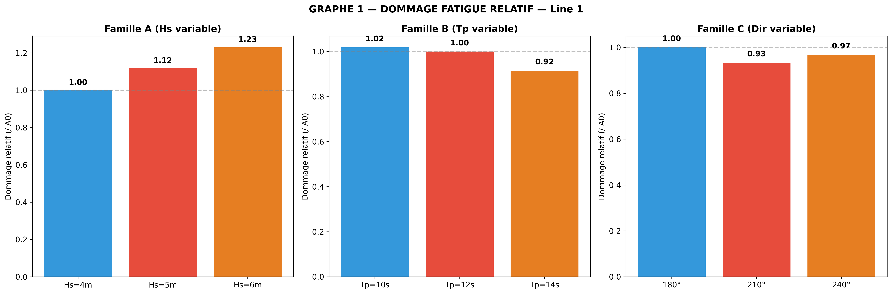
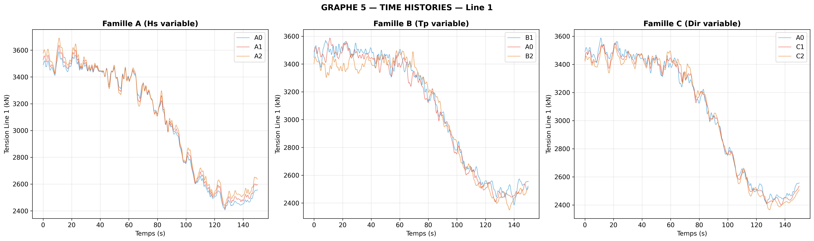
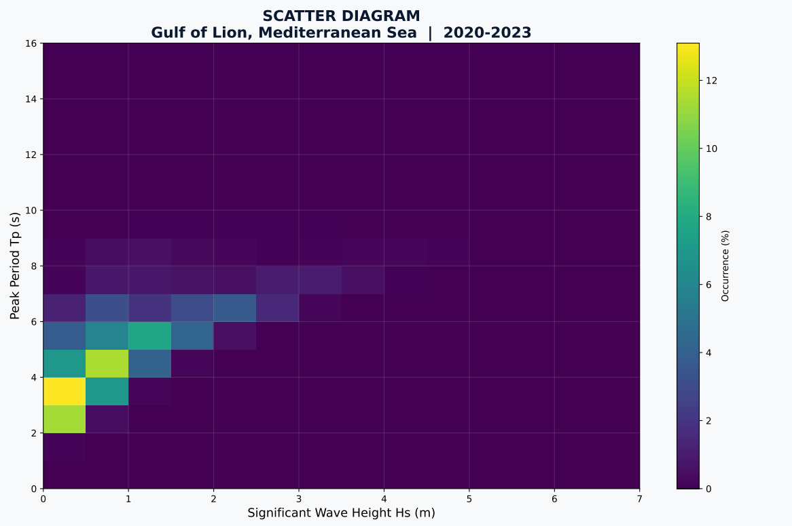
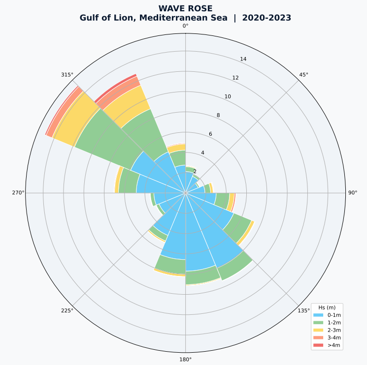
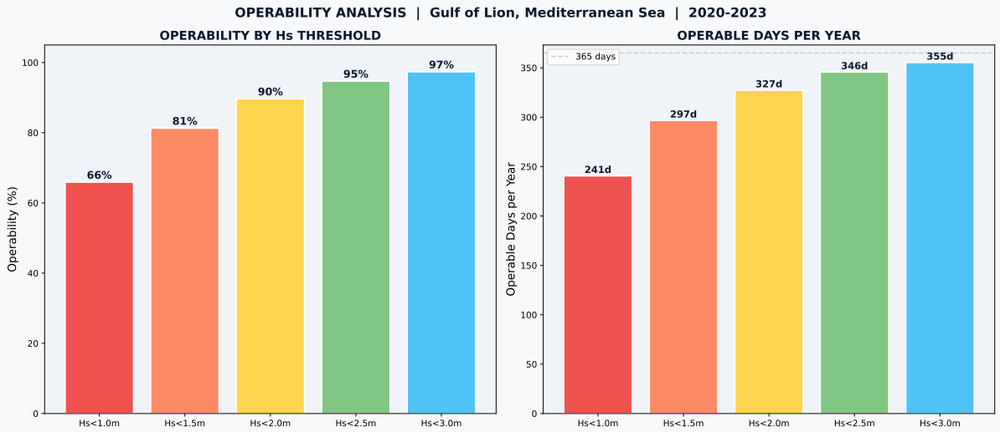

# Chifaa Saghrouni

## Maritime Engineer | Hydrodynamics & Offshore Structures

---

---

### About Me

Maritime engineer graduated from **École Centrale Méditerranée** (Naval & Ocean Engineering) and **ENIM** (Mechanical Engineering), specialised in **hydrodynamics**, **mooring analysis** and **numerical modelling** for offshore floating structures.

Hands-on experience in coupled hydrodynamic analysis, fatigue assessment of mooring systems, and wave climate data processing at **DORIS Group / Océanide** (France Énergie Marine R&D project).

**Core Skills:** OrcaFlex | OrcaWave | DeepLines | Python | Abaqus

📧 [chifaasagh@gmail.com](mailto:chifaasagh@gmail.com)  
🔗 [LinkedIn]((https://www.linkedin.com/in/chifaa-saghrouni-82967b236/))  
📄 [Download my CV](./CV_Chifaa_SAGHROUNI.pdf)

---

## Projects

### 🌊 Project 1 — Mooring Fatigue Analysis (FOWT 15 MW)

**Parametric study of mooring line fatigue for a semi-submersible floating wind turbine**

- Modelled a complete 15 MW FOWT system (IEA reference, UMaine VolturnUS-S) in **OrcaFlex**
- Ran 7 parametric load cases varying Hs, Tp and wave direction
- Applied **Rainflow counting** (ASTM E1049) + **Miner's rule** (DNV S-N curves) via Python
- **Key result:** Wave height (Hs) is the dominant parameter → +23% fatigue damage when Hs increases from 4m to 6m
- The windward mooring line carries **~20× more fatigue damage** than leeward lines

**Tools:** OrcaFlex, OrcaWave, Python (rainflow, pandas, matplotlib)

| Parameter | Family A (Hs) | Family B (Tp) | Family C (Dir) |
|-----------|---------------|---------------|----------------|
| Damage variation | **+23%** | -8% | -7% |
| Impact level | Dominant | Moderate | Limited |

📌 [Read the full LinkedIn post](https://lnkd.in/p/eMndyx_a)

---

### 🌊 Project 2 — Offshore Wave Climate Analysis (Gulf of Lion)

**Scatter diagram and operability analysis using real ERA5 wave data**

- Processed **40,908 data points** from ERA5 Reanalysis (Copernicus) for 2020-2023
- Built **scatter diagram** (Hs vs Tp), **wave rose** and **operability statistics**
- Identified optimal installation windows and maintenance access periods

**Key Statistics (Gulf of Lion, 2020-2023):**

| Parameter | Value |
|-----------|-------|
| Mean Hs | 0.94 m |
| P90 Hs | 2.02 m |
| Max Hs | 6.38 m |
| Crew transfer operability (Hs<2m) | ~90% |
| Heavy lift operability (Hs<1.5m) | ~75% |
| Best installation window | June-August |

**Tools:** Python (netCDF4, matplotlib, numpy), ERA5/Copernicus data

📌 [Read the full LinkedIn post](https://lnkd.in/p/eDVNSsvs)

---

## Professional Experience

### DORIS Group / Océanide, Toulon — End-of-studies Internship
**April 2025 – September 2025** | France Énergie Marine R&D Project

- Performed hydrodynamic calculations (diffraction/radiation) for floating offshore structures
- Compared 6 calculation methods (frequency/time domain, coupled/uncoupled, with/without 2nd order effects)
- Defined load cases and operability criteria for maintenance operations
- Implemented dynamic positioning system via Python scripting
- **Tools:** OrcaFlex, OrcaWave, DeepLines, Python

### LMA (CNRS), Marseille — Internship
**June 2024 – July 2024**

- Finite element modelling of complex structures (Specfem2D, Gmsh)
- Numerical data processing and analysis
- **Tools:** Specfem2D, Gmsh, Python

---

## Education

| Degree | School | Year |
|--------|--------|------|
| MSc Naval & Ocean Engineering | École Centrale Méditerranée | 2023-2025 |
| BSc/MSc Mechanical Engineering | ENIM, Tunisia | 2021-2023 |
| Preparatory Cycle (Physics) | IPEI Bizerte, Tunisia | 2019-2021 |

---

## Technical Skills

| Domain | Skills |
|--------|--------|
| **Hydrodynamics** | Diffraction/radiation, RAOs, QTFs, mooring dynamics, fatigue, operability |
| **Offshore Software** | OrcaFlex, OrcaWave, DeepLines |
| **FEA/CAD** | Abaqus, SolidWorks, Specfem2D, Gmsh |
| **Programming** | Python (rainflow, pandas, matplotlib, numpy, netCDF4) |
| **Data** | Wave climate analysis, ERA5/Copernicus, scatter diagrams |
| **Standards** | DNV-OS-E301, DNV-RP-C203, DNVGL-ST-N001, ASTM E1049 |

---

## Languages

| Language | Level |
|----------|-------|
| Arabic | Native |
| French | C1 (Fluent) |
| English | B2 (Professional) |

---

## Contact

📧 **Email:** [chifaasagh@gmail.com](mailto:chifaasagh@gmail.com)  
🔗 **LinkedIn:** [Chifaa Saghrouni]([https://www.linkedin.com/in/chifaa-saghrouni](https://www.linkedin.com/in/chifaa-saghrouni-82967b236/))  
📍 **Location:** Marseille, France  
✅ **Status:** Available immediately

---

*Last updated: July 2026*
